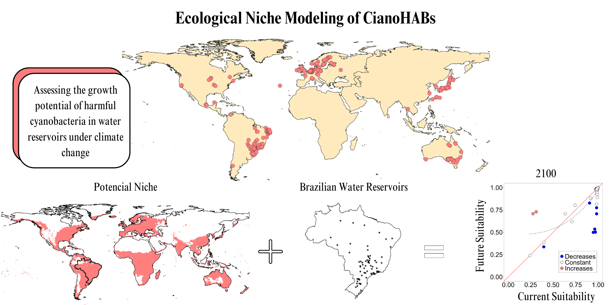

# Assessment of the growth potential of harmful cyanobacteria in aquatic environments under climate change scenarios

### Ariane Guimarães , Pablo Silva , Daniel Paiva Silva 

#### **Abstract**:  

Neotropical freshwater environments face severe threats from climate change, which pose significant risks to global water security. Extreme hydrological events, such as torrential rains and prolonged droughts, are expected to become more frequent and intense. These conditions increase the residence time of nutrients, especially phosphorus and nitrogen, favoring the proliferation of harmful cyanobacteria (cyanoHABs). Furthermore, cyanobacteria are competitive in environments with few nutrients and high CO2 concentrations. This feature exacerbates ecological and public health challenges, as these cyanobacteria can cause harmful algal blooms that contaminate water supplies and disrupt aquatic ecosystems. Aim of specific regions to the prevalence of three representative species of cyanoHABs. **Methods**: We used ecological niche modeling tools (ENMs) based on occurrence records from available databases to predict the distribution of the three most frequently representative species of cyanoHABs. We employed three different modeling methods: generalized linear models (GLM), Gaussian models (GAU), and maximum entropy (MXS). **Results**: In the ENMs results, the distributions for the current scenario were consistent with known distributions. We identified new areas of research for future scenarios. **Conclusions**: The variations we observed indicate that the impacts of climate change vary regionally, affecting the future fitness of cyanobacteria. In the short term, they may maintain stable fitness, but a significant reduction is expected in the long term due to high temperatures. This result highlights the urgent need for mitigating actions to protect aquatic ecosystems.

**Keywords**: Ecological niche model, cyanoHABs, *Microcystis aeruginosa*, *Planktothrix agardhii*, *Raphidiopsis raciborskii*, toxins

### Repository structure

  * `Images` Contains the image used in the README 
  * `R` Contains the codes in sequential order of execution  